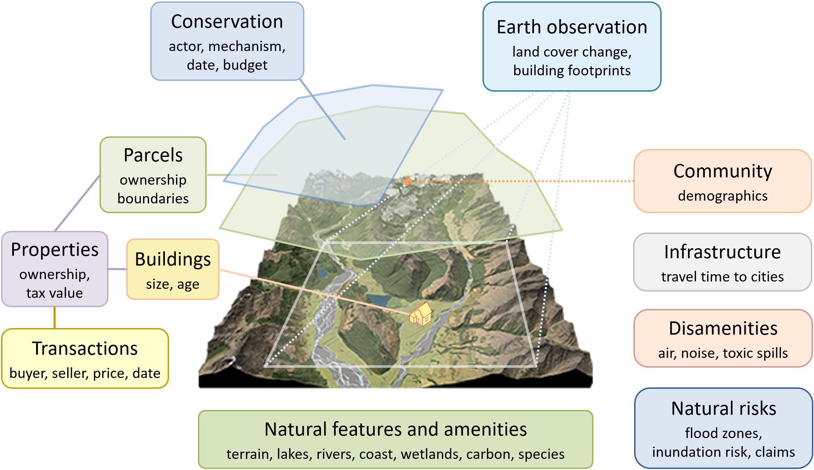

.. openplaces

Overview
========

``openplaces`` is a Python package for place-based geospatial analysis.

The purpose of ``openplaces`` is to make data-intensive, property-level research more replicable and comparable, globally.

The package streamlines the aggregation of geospatial property datasets (parcels, buildings, taxed properties, transactions) and their linkage to social and environmental geospatial information and modern data science tools.

.. toctree::
   :maxdepth: 2

   1_overview/concepts
   1_overview/pipeline
