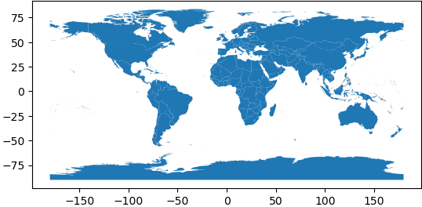

.. openplaces

.. _administrative_units:

Administrative units
====================

Administrative units are the geographic regions at which property data is organized. They mostly refer to countries and in-country subdivisions.

``openplaces`` uses a globally resolvable, hierarchical (multi-level) set of identifiers for administrative units.

Levels
~~~~~~

Four levels of administrative units are currently supported:

.. list-table::
   :header-rows: 1
   :widths: 5 20 10 60

   * - 
     - Description
     - Name in code
     - Examples of identifiers
   * - 0
     - Earth
     - 
     - ``None``
   * - 1
     - Countries & territories
     - ``admin1``
     - ``US`` United States

       ``CO`` Colombia
   * - 2
     - States, departments, etc.
     - ``admin2``
     - ``US-MA`` state of Massachusetts

       ``CO-AN`` department of Antioquia
   * - 3
     - Counties, municipalities, etc.
     - ``admin3``
     - ``US-MA-MI`` Middlesex county, Massachusetts, U.S.

       ``CO-AN-ME`` municipality of Medellín, Colombia
   * - 4
     - Cities, towns, subdivisions, etc.
     - ``admin4``
     - ``US-MA-MI-SO`` city of Somerville

       *Not all countries have level-4 IDs defined; may require a custom recipe*

Identifiers
~~~~~~~~~~~

``openplaces`` has its own table of global identifiers for administrative units to simplify data exchange amongst its users (``admin-openplaces-2026``, `see recipe here <https://github.com/chrnolte/openplaces/tree/main/src/openplaces/recipes/_all/admin/openplaces/2026>`_).

The dataset is mostly derived from the `Global Administrative Database <https://gadm.org/>`_ (GADM) and supplemented with in-country updates from official data sources.

Administrative identifiers are a hybrid of existing codes and ``openplaces`` creations. These choices reflect pragmatic reasons (available data, not political endorsements) and will likely adapt in time.

Example: ``US-MA-MI-SO`` (city of Somerville in the state of Massachusetts, U.S.)

-  ``US`` and ``MA`` (Massachusetts): International Standards Organization (ISO)
-  ``MI`` (Middlesex county): based on `HASC <https://statoids.com/ihasc.html>`_ codes obtained from GADM.
-  ``SO`` (Somerville): generated internally (no prior standard)

Boundaries
~~~~~~~~~~

If you want to make maps of administrative boundaries or use them for geoprocessing (e.g., identifying all building footprints within a county), you need to import the boundaries from their original source first.

Import official administrative boundaries
-----------------------------------------

To import official in-country geometries (e.g., as a reference for your geoprocessing), run this notebook with a country recipe:

   `notebooks/02_ingest/admin/ingest_admin.ipynb <https://github.com/chrnolte/openplaces/blob/main/notebooks/02_ingest/admin/ingest_admin.ipynb>`_

Import global administrative geometries
---------------------------------------

To import global geometries (GADM, >2 GB), run this notebook:

   `notebooks/01_setup/03_ingest_global_administrative_units.ipynb <https://github.com/chrnolte/openplaces/blob/main/notebooks/01_setup/03_ingest_global_administrative_units.ipynb>`_

After that, you can make precise global maps (though these will be slow to generate: >10 seconds).

.. code-block:: python

   from openplaces.api import get_admin

   get_admin(geom=True).plot()

