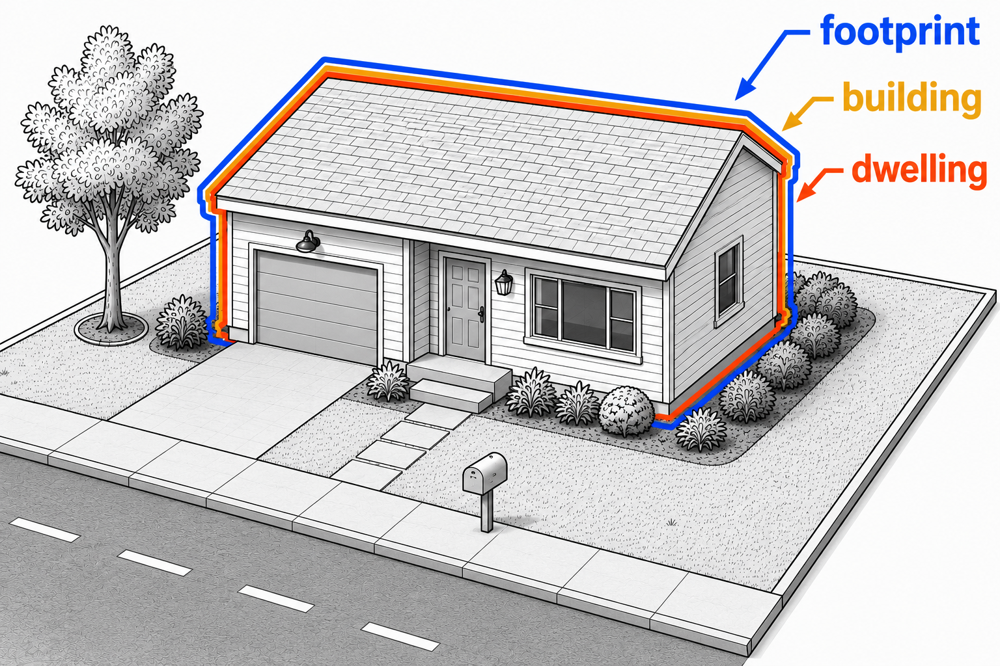

.. openplaces

.. _entities:

Entities: parcels, buildings, etc.
==================================

Entities are the units of analysis in ``openplaces``.

They refer to the fundamental building blocks of property information: parcels, buildings, transactions, etc.

In a table or dataframe, entities are represented by **rows**: reach row is a unique entity (e.g., a building).

Most data processed in ``openplaces`` is attributed to an entity.

Datasets organized by entities are covered here. For datasets that are not organized by entity (e.g. a global raster image, a text, a non-entity table), see :ref:`datasets <datasets>`.

Building blocks
~~~~~~~~~~~~~~~

.. _parcels:

Parcels
-------

Parcels are geo-referenced boundaries that describe a spatial unit of property: a lot of land.

Parcel data is most often created by local land surveyors and tax assessors, typically with the goal of covering all taxable property within a given administrative unit.

.. _buildings:

Buildings
---------

Buildings are human-built structures with a roof.

Buildings often constitute the largest share of a parcel's value.

Some buildings are separable from parcels, e.g., a mobile home.

Hazard risk models often require:

- the location of buildings, e.g., for flood risk models.
- structural properties, e.g., for earthquakes, hurricanes, tornados.

Buildings are neither dwellings nor footprints.

.. _footprints:

Footprints
----------

Footprints are the boundaries a building envelope as seen from space.

Footprints are usually produced from satellite imagery.

An urban footprint, e.g. in New York, might contain multiple parcels, each with its own building, e.g. townhomes.

Some hazard models involving wind (e.g., for hurricane exposure) operate at the footprint level, e.g., :ref:`CHEER footprints <cheer_footprints>`.

.. _dwellings:

Dwellings
---------

.. image:: images/footprint_building_dwelling_urban.png
  :width: 400
  :alt: Illustration of footprints, buildings, and dwellings
  :align: right

Dwellings are individual residential units within a building, e.g.:

- an apartment in a building.
- a unit in a two-family.
- a condominium (separate ownership).
- one single-family home.

Address and census databases commonly refer to dwellings.

.. _properties:

Properties
----------

Properties are the assets (property rights) that are sold, valued and taxed.

The taxable property is the unit by which most tax assessors organize information.

In practice, properties can be any collections of entities. A property can be:

- a parcel (and not include the manufactured home on it)
- a building (a multi-family unit)
- a dwelling (a condominium)
- both (a multi-apartment complex)
- or an entire different type of right (e.g., right of way).

.. _transactions:

Transactions
------------

Transactions are events in which one or more :ref:`properties <properties>` change full or partial ownership.

This typically happens in the form of a sale or easement.

They are recorded in deeds or similar documents.

Transaction data may identify the seller, buyer, the property, and the date and is private in many countries.

Spatial reference and partitioning
~~~~~~~~~~~~~~~~~~~~~~~~~~~~~~~~~~

Two types of entities — :ref:`administrative units <administrative_units>` and :ref:`tiles <tiles>` — serve as spatial partitions for data storage and ingestion of other entities.

.. _entity_administrative_units:

Administrative units
--------------------

:ref:`Administrative units <administrative_units>` are a special type of entity. See the :ref:`section on administrative units <administrative_units>` to learn how they are defined and referred to.

All :ref:`recipes <recipes>` belong to an administrative unit (global, country, state, county or similar). Many external dataset downloads are partitioned by administrative units (e.g., US building footprints by state). Most datasets in ``openplaces`` are organized by administrative unit.

.. _tiles:

Tiles
-----

Tiles are fixed spatial grid cells that cover a geographic area.
They are used to partition global or large-area datasets into manageable download and processing chunks.

For instance, `OpenBuildingMap <https://gee-community-catalog.org/projects/obm/>`_ serves global building footprints by tile. `Global Forest Change <https://storage.googleapis.com/earthenginepartners-hansen/GFC-2024-v1.12/download.html>`_ serves global raster data by tile.
