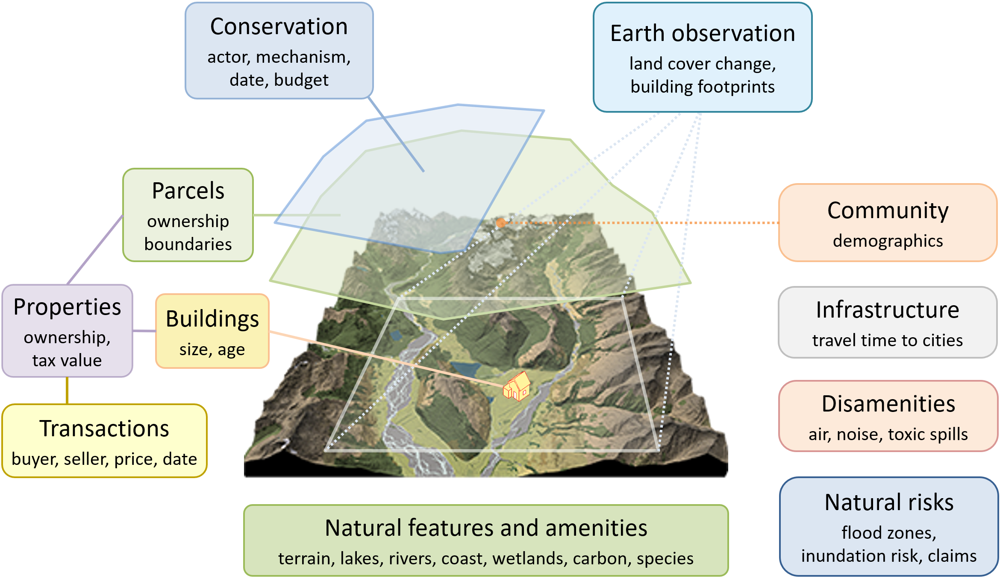

.. openplaces

Why openplaces?
===============

``openplaces`` is an open-source processing engine for land, building, and property data.

It is designed to synthesize and analyze rich microdata for millions of properties.

Use case
~~~~~~~~

You are most likely to find ``openplaces`` helpful if:

- You want to analyze microdata on parcels, buildings, properties, or transactions.
- You want to control for a diverse set of attributes:

  - Physical and social attributes linked to home preferences
  - Time series of land cover, lake water quality, sales, or valuation.
- You need large sample sizes (>10,000 parcels or sales) to:

  - Test findings for generalizability and robustness
  - Understand heterogeneity in effect sizes
  - Detect small effects.
- Your work needs to be replicable and `FAIR <https://www.go-fair.org/fair-principles/>`_.

Examples of use cases (from research at the `placeslab <https://placeslab.org>`_):

- Estimating `effects of conservation interventions <https://placeslab.org/research/#effectiveness>`_
- Valuing `environmental amenities and risks <https://placeslab.org/research/#valuation>`_
- Valuing land for `conservation planning <https://placeslab.org/research/#cost>`_ and property taxation
- Estimating damage costs from natural hazards, e.g. `from hurricanes <https://www.drc.udel.edu/cheer/>`_

Generating, analyzing, and documenting such data is no simple feat.

``openplaces`` tries to make it easier.

Open source
~~~~~~~~~~~

.. image:: images/open_source.png
  :width: 58
  :alt: Open source logo
  :align: right
  :class: padded-image

``openplaces`` is open source.

It is published `on Github <https://github.com/chrnolte/openplaces>`_ under a permissive `Apache 2.0 license <https://www.apache.org/licenses/LICENSE-2.0>`_.

Science lift everyone's boat when data synthesis and analysis are publicly accessible and replicable. Leading public funders - the `US National Science Foundation <https://www.nsf.gov/public-access>`_, the `European Research Council <https://erc.europa.eu/manage-your-project/open-science>`_, `Japan’s Science & Technology Agency <https://www.jst.go.jp/EN/about/strategy.html>`_, and Brazil's `FAPESP <https://www.fapesp.br/openscience/en>`_ - expect open access, data management plans, and public sharing of research outputs. Global frameworks like the `UNESCO Recommendation on Open Science <https://www.unesco.org/en/open-science/about>`_ and initiatives like `cOAlition S <https://www.coalition-s.org/>`_  promote the idea of code and datasets as public infrastructure.

But land ownership and property data is rarely openly shared. It is sensitive, often identifiable, and subject to privacy protections. Public records are created by thousands of government agencies in a myriad of formats, making aggregation a formidable task. Researchers conducting large-scale analyses usually buy data licenses from commercial aggregators who discourage public sharing.

Peer-reviewed journals in land, environmental, or housing economics therefore rarely expect publication of data. Datasets that took analysts months or years to put together become unavailable after use. And the next person has to start from scratch.

This worsens the credibility problem of the empirical social sciences, e.g. in `environmental <https://www.journals.uchicago.edu/doi/10.1093/reep/reaa011>`_ and `agricultural economics <https://onlinelibrary.wiley.com/doi/full/10.1002/aepp.13323>`_. When `data quality and methods affect results <https://le.uwpress.org/content/100/1/200>`_, publication bias favors novelty and statistical significance, and re-analyses are rare, professional competition can incentivize questionable research practices.

Access to open and replicable methods can counter this trend. Publishing the codebase of entire research workflows allows others to revisit results, interrogate findings, share bug reports, and contribute improved methods.

Scalable
~~~~~~~~

``openplaces`` is designed to facilitate large-scale analyses.

Most empirical studies of property data produce insights for a given region:

- a city, town, or municipality
- a state, province, or department
- a country

But how generalizable are such local insights? Do they replicate elsewhere?

Often, they don't. For instance, economists found that transferring environmental benefit estimates from one location to another is subject to large errors (e.g., a `median of 39% in the U.S. and Western Europe <https://doi.org/10.1016/j.jeem.2013.03.001>`_).

Replicating studies in multiple locations can generate insights that are more context-sensitive, statistically robust, and representative.

With ``openplaces``, you can create a city-wide analysis on your laptop.

Later, you can send your script to a cluster and run the same analysis for thousands of cities.

At Boston University's `placeslab <https://placeslab.org>`_, we attributed data from satellite to 133 million parcels in the US. We used this data for `land valuation <https://placeslab.org/research/#cost>`_ and `hedonic valuation <https://placeslab.org/research/#valuation>`_, producing tens of terabytes of trained models on our research cluster.

Global referencing
~~~~~~~~~~~~~~~~~~

To simplify data integration and exchange, ``openplaces`` ships with a globally consistent, hierarchical referencing system of :ref:`administrative units<administrative_units>`:

- :input:`US` -> United States
- :input:`CO-AN` -> Antioquia, a department of Colombia
- :input:`US-CA-LA` -> Los Angeles county in California, U.S.
- :input:`US-MA-MI-CA` -> The city of Cambridge in Middlesex county, Massachusetts, U.S.

These identifiers organize the :ref:`directory structure <directory_structure>` of ``openplaces``. This makes it easy to restrict or expand access to sensitive data on different locations or from different sources to different groups of collaborators.

Similarly, parcels receive a globally unique permanent identifier (``parcel_id``) that is derived from its geometry, snapped to avoid rounding errors, and securely hashed to keep parcel locations private when needed. 

Privacy-enabling
~~~~~~~~~~~~~~~~

While the code of ``openplaces``, including contributed recipes, is open-source, the underlying data doesn't have to be.

``openplaces`` allows the privacy-conscious analysts to create a data set from for their home location from restricted data in a secure computing environment, analyze it with publicly shared methods, and share replicable results for feedback and publication - all without ever providing access to the underlying data.

Extensible
~~~~~~~~~~

``openplaces`` makes it easy to integrate new datasets through :ref:`recipes <recipes>`.

Recipes are machine-readable instructions for data ingestion, harmonization, enrichment, and curation (see :ref:`pipeline <pipeline>` for a description of each stage).

New users :ref:`write recipes<writing_recipes>` to ingest new datasets, add attributes, and create canonical, publishable datasets for subsequent analysis.

Recipes can be :ref:`contributed <contribute>` to the public repository to permit others to replicate and expand on prior work. Contributors receive recognition through badges and added exposure and citations for their research papers.

Cross-platform
~~~~~~~~~~~~~~

.. image:: images/cross_platform.png
  :width: 150
  :alt: Open source logo
  :align: right
  :class: padded-image

``openplaces`` runs on all three major desktop operating systems.

You can deploy it on:

- a government agency's desktop computer running Windows
- a student's Macbook
- a university research cluster running Linux (for instance, at Boston University)

This is possible because ``openplaces`` is written in `Python <https://www.python.org/>`_ on top of a rich open-source geospatial ecosystem, including GDAL, GeoPandas, Rasterio, Xarray, Parquet, scikit-learn, and XGBoost.

