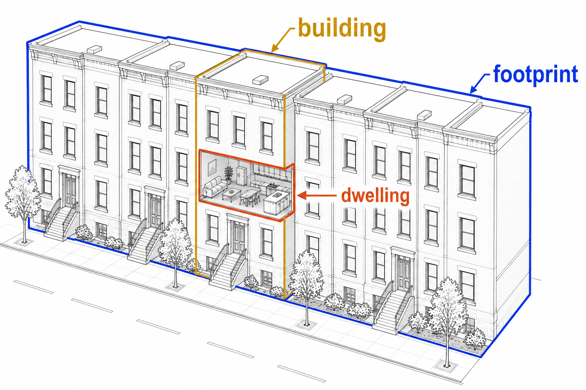
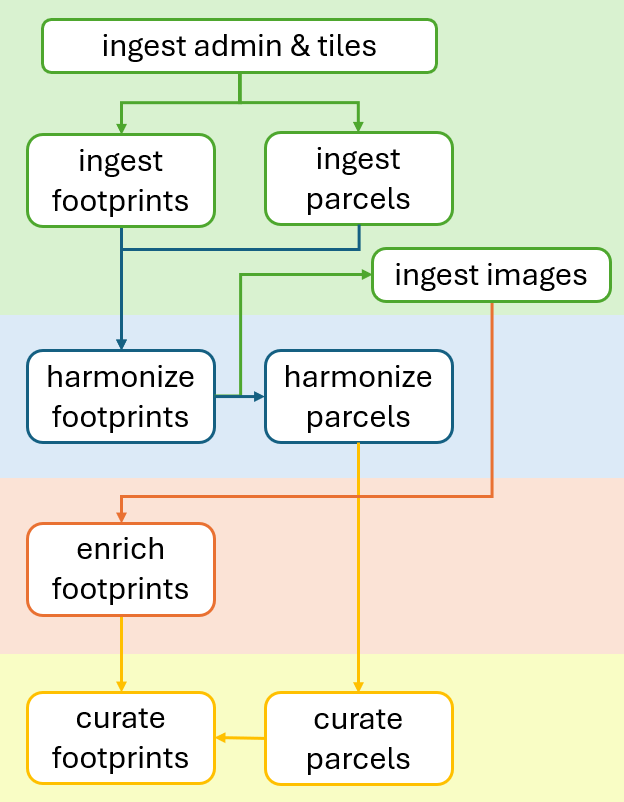

.. openplaces

.. _cheer_footprints:

U.S. footprint inventory (CHEER)
================================

This recipe creates a footprint-level building inventory for hurricane damage and exposure modeling in the U.S.

It first resolves building :ref:`footprints <footprints>` from multiple polygon sources (OpenBuildingMap, Microsoft, and local datasets), then enriches each footprint with data from linked parcels, the National Structure Inventory (NSI), Overture :ref:`dwelling <dwellings>` addresses, and FEMA's USA Structures.

It also integrates deep-learning-based recognition of roof shapes and story counts from Google Satellite and Street View imagery (BRAILS++).

Where a modeled inventory already exists for a region, the same attributes can be read off it instead of re-running inference. In North Carolina, the CHEER Inventory v0 supplies statewide roof shape, foundation, construction type, garage, and story evidence at no imagery cost.

The pipeline is currently being tested in Florida, North Carolina, and Texas.

* **Curation recipe**: :gh-file:`src/openplaces/recipes/US/_all/footprint/cheer/2026/US_footprint-cheer-2026.yaml`
* **Companion notebook**: :gh-file:`notebooks/examples/US_curate_footprints.ipynb`

This work is supported by NSF's Coastal Hazards, Economic Prosperity & Resilience hub (`CHEER <https://www.drc.udel.edu/cheer/>`_).

Regional release: Eastern North Carolina
~~~~~~~~~~~~~~~~~~~~~~~~~~~~~~~~~~~~~~~~

The companion notebook pools the curated per-county outputs of the 45 Eastern North Carolina counties into one shareable delivery. The delivery is four files rather than one, so a consumer downloads only the part they need:

.. list-table::
   :header-rows: 1
   :widths: 45 15 40

   * - File
     - Size
     - Holds
   * - :file:`US-NC_footprint-cheer-2026.parquet`
     - 112 MB
     - The canonical attributes and their provenance sidecars, as a plain table. The file to hand to a modeller.
   * - :file:`US-NC_footprint-cheer-2026_point.parquet`
     - 205 MB
     - The same attributes on centroid points, plus ``structure_value_per_area``. Small enough to map directly.
   * - :file:`US-NC_footprint-cheer-2026_geo.parquet`
     - 316 MB
     - The footprint polygons, nothing else. Needed only when the outline itself matters.
   * - :file:`US-NC_footprint-cheer-2026_evidence.parquet`
     - 312 MB
     - Every remaining curated column: the source-attributed evidence the canonical values were reconciled from.

All four carry the same ``footprint_id`` index in the same row order, so any two of them rejoin one-to-one. Which columns count as canonical is declared in the recipe's ``share:`` block; each one's ``{column}_source`` sidecar is appended automatically, and the sidecars are written into both the canonical and the evidence file so either reads on its own.

The delivery holds 2,495,550 rows, against 2,495,582 across the per-county files: footprints captured by two neighboring counties' pipelines near a shared county line are deduplicated - 32 rows - keeping whichever copy has the fuller attribute coverage.

The delivery is the pipeline's terminal step, not a manual one. The orchestrated workflow ends in a ``deliver`` job that pools the region and writes the four files, so a full run ships without anyone remembering to; a run scoped to a single county stops at curation instead, leaving the shipped files untouched. The region's 45 counties and the canonical column list are both declared in the recipe's ``share:`` block, so the notebook and the pipeline deliver the same thing. The written files are left read-only, and the delivery step unlocks them itself when it reships.

A ready-made QGIS project ships beside the data as :file:`US-NC_footprint-cheer-2026_map.qgz`, generated by ``export_qgis_map(recipe, 'US-NC', include_inputs=False)``. It carries the basemaps, the administrative boundaries, and the inventory itself, and nothing else - none of the ingest-stage source layers that a per-county diagnostic map shows.

The inventory appears twice, deliberately. The attribute views are drawn from the centroid points, categorized by ``occupancy_type`` with alternate views for ``roof_shape``, ``n_stories`` and ``geometry_source``; the polygons are drawn as plain outlines with no attributes joined to them. Nothing in the project joins one file to another, which is what keeps it quick to open: classifying 2.5 million polygons would mean reading and indexing the 316 MB geometry file before anything could be drawn, for colors that are legible from the centroids alone. Turn the outline layer on when a building's shape matters.

Views keyed on a column the canonical set does not carry are omitted rather than shipped empty - the evidence-column views (occupancy-type conflicts, priority on parcel, and the two per-area valuations) are absent for that reason.

To open the files by hand instead, use the :guilabel:`Load joined openplaces parquet files` processing algorithm. Pick any one of the four, choose boundary polygons or centroid points, and tick :guilabel:`Join evidence columns` when the supplement is wanted too. That algorithm resolves the join key itself, so it reads a core ``_join_id`` file and an inventory file keyed on ``footprint_id`` equally well.

Coverage of the :ref:`containing-area identifiers <containing_area_ids>`, as a minimum across the 45 counties:

.. list-table::
   :header-rows: 1
   :widths: 55 45

   * - Column
     - Minimum county coverage
   * - ``admin4_id``, ``census_subdivision_id``, ``census_tract_id``, ``census_blockgroup_id``
     - ≥ 99.8%
   * - ``census_block_id``
     - ≥ 98.9%
   * - ``zcta5_id``
     - ≥ 62.2%

The lower floor on ``zcta5_id`` is expected rather than a defect: ZIP Code Tabulation Areas follow postal delivery areas and do not tile all land, so a footprint in an area no carrier route covers has no ZCTA to fall in.

Running the pipeline
~~~~~~~~~~~~~~~~~~~~

The stages are driven from the companion notebook, which can also be run as a script for whole regions.

.. warning::

   On Windows, set :input:`PYTHONIOENCODING=utf-8` for any non-interactive run whose output is redirected to a file or a log. Progress messages contain non-ASCII characters that the default :input:`cp1252` console encoding cannot encode, which aborts the run with a ``UnicodeEncodeError`` partway through - after the expensive work has already been done.

Output columns
~~~~~~~~~~~~~~

This recipe produces one :file:`.parquet` file per county.

Each row represents a deduplicated footprint (or parcel fallback).

The columns below are the full per-county schema. The regional delivery above splits them across its four files: the compact set named in the recipe's ``share:`` block goes to the canonical file and to the centroid points, the geometry to :file:`_geo`, and everything else - including the canonical attributes not on that short list, such as ``land_value``, ``n_dwellings`` and the address components - to :file:`_evidence`. Nothing is dropped; the four files together still carry every column documented here.

Canonical attributes
--------------------

``footprint_id``
    A unique identifier for each footprint: its 11-digit `openlocationcode <https://github.com/google/open-location-code>`_ (duplicate codes receive a numeric suffix, e.g., :input:`-1`, :input:`-2`, to guarantee uniqueness).
``geometry``
    The spatial polygon outlining the footprint, or the parcel polygon for fallback records.
``geometry_source``
    Source of the geometry: :input:`obm` (OpenBuildingMap), :input:`microsoft`, local state sources (e.g., :input:`nconemap`), or :input:`parcel.<source>` for parcel-shaped fallbacks representing unlocated structures.
``address``
    Reconciled street address. Prioritizes the assessor parcel address (where available), falling back to Overture dwelling address components, completed with state names derived from administrative units.
``occupancy_type``
    Canonical occupancy class.

    Multi-Family structures are split into HAZUS height bands (Low-Rise: 1-3 stories, Mid-Rise: 4-7 stories, High-Rise: 8+ stories) based on ``n_stories``. Multi-Family rows with no story count keep the plain ``Multi-Family`` label.
``n_sections``
    Number of factory-built sections a manufactured home shipped in: 1 for a single-wide, 2 for a multi-section (double-wide), 3 for a triple-wide.

    Decided by the same weighted vote as every other classification here, gated on ``occupancy_type == 'Manufactured Home'`` - so it is missing for every other class. Two lanes of evidence: the section count the assessor states in its own land-use text (exact, but present in only ten of the 45 delivered counties), and footprint shape, which is available everywhere. A section is a road-legal load, so its width is near-constant while its length is not; multi-section homes sit at a median footprint width of 8.85 m against 5.39 m for single-wides.

    Two nulls to tell apart, both of which mean "no claim", never "one section": the footprint is not a manufactured home, or its width and its elongation contradict each other, in which case neither decision reaches its threshold. Shape alone resolves 77.4% of manufactured homes at 86.8% accuracy, but multi-section is 82.2% of those rows, so the shape lane is worth only about +4.6 points over always answering "multi-section". Its value is that it finds single-wides at all - at 0.626 precision and 0.509 recall. Treat a single-wide from the shape lane as a useful flag rather than a fact, and take ``section_keyword_class`` from the ``_evidence`` file to restrict yourself to the rows the assessor labelled itself.
``structure_value``
    Reconciled structure value in USD. Prioritizes the parcel's improvement value (apportioned across its primary footprints by floor-area share), falling back to the NSI structure replacement value.
``year_built``
    Reconciled construction year. Prioritizes assessor parcel records over NSI block-median fallbacks.
``n_stories``
    Reconciled number of stories. Prioritizes street-level imagery predictions (BRAILS++), then NSI modeled counts, then a modeled inventory's count - last because it shares NSI's modeled lineage rather than being an independent observation.
``n_dwellings``
    Reconciled count of dwelling units. Prioritizes Overture geocoded address counts over NSI structure counts, falling back to occupancy-class imputation.
``height``
    Reconciled building height in meters (where available from the footprint source, e.g. OpenBuildingMap).
``roof_shape``
    Reconciled roof structure classification (e.g., Gable, Hip, Flat) from visual models. Prioritizes this repository's own per-image classification, falling back to the CHEER Inventory v0 run of the same classifier. Both are BRAILS++ outputs, so this is a coverage cascade rather than a quality ranking: whichever actually ran for the county wins.
``roof_shape_confidence``
    Classifier confidence in ``roof_shape``.
``roof_shape_2`` / ``roof_shape_3``
    The classifier's second- and third-ranked alternative roof shapes, with ``roof_shape_confidence_2`` / ``roof_shape_confidence_3``. The top class is near-saturated, so the runner-up is what carries information when the leader is weak.
``foundation_type``
    Reconciled foundation classification. Prioritizes NSI, using Inventory v0 only where NSI is silent - not a blanket judgement on the inventory, but a guard against a failure mode NSI's regional prior cannot have: the inventory's per-county class shares swing widely, and in at least one coastal county where basements are near-absent the Basement class collapses onto most buildings and carries no information.
``construction_type``
    Structural construction material class (e.g., wood, masonry, steel, concrete).
``has_garage``
    Whether the building has a garage.
``m2``
    Calculated footprint area in square meters.
``priority_on_parcel``
    Structural role: :input:`primary` (main structure), :input:`secondary` (accessory structure), or :input:`unknown` (unlinked to parcel).

.. note::

   ``roof_shape_confidence``, the ranked roof-shape alternatives, ``construction_type``, and ``has_garage`` currently reach the output only for counties covered by a modeled inventory (North Carolina). They are empty elsewhere.

Containing-area identifiers
---------------------------

Identifiers of the areas each footprint falls in, assigned during harmonization (see :ref:`containing-area identifiers <containing_area_ids>`). They let the inventory be joined to any statistic published for those areas without repeating the spatial join.

``admin4_id``
    ``openplaces`` administrative unit at level 4 (town, city, county subdivision).
``census_subdivision_id``
    Raw U.S. Census county subdivision (COUSUB) code for that same level-4 unit.
``census_tract_id`` / ``census_blockgroup_id`` / ``census_block_id``
    U.S. Census tract, block group, and block.
``zcta5_id``
    5-digit ZIP Code Tabulation Area. A statistical approximation of a ZIP code's service area, not the authoritative ZIP; ``postal_code`` prefers a real address-parsed value and only falls back to this.

Provenance sidecars
-------------------
Indicates which input dataset or curation rule set decided the final canonical value (later steps override earlier ones). The values contain short method/source strings (e.g., ``parcel``, ``nsi``, ``overture``, ``imputed``, ``geometry``, ``dwellings``, ``secondary``, ``park``, ``keyword``, ``manufactured_home``, ``brails-2026``):

* ``address_source``
* ``occupancy_type_source``
* ``structure_value_source``
* ``year_built_source``
* ``n_stories_source``
* ``n_dwellings_source``
* ``roof_shape_source``

Parcel-derived evidence (assessor)
----------------------------------
Attributes inherited from the primary parcel linked to the footprint.

``parcel_id``
    Globally unique ID of the primary linked parcel, used to join parcels back onto footprints.
``parcel_id_local`` / ``parcel_id_local_all``
    Locally cross-comparable assessor ID of the primary linked parcel, and combined IDs of all intersected parcels (populated only if more than one distinct ID exists). Not unique across administrative units, so it is not used as a join key.
``use_group_combined_parcel`` / ``use_group_combined_parcel_all``
    Primary and combined land-use description strings (populated only if more than one distinct use exists).
``land_use_class_parcel``
    Curated parcel land-use classification mapped into 11 potential classes (e.g., Vacant, Manufactured Home, Retail, Office).
``occupancy_type_parcel``
    Assessor-proposed occupancy based on property keywords/groups.
``occupancy_type_footprint_fema``
    Each parcel's dominant FEMA USA-Structures occupancy class by overlap area (remapped via the ``US_footprint-fema-2023_occupancy-type-remap`` crosswalk). Used as second-ranked evidence in the base occupancy cascade.
``land_value_parcel``
    Assessor land valuation. Kept in full on primary footprints and set to missing (null) on secondary footprints.
``improvement_value_parcel``
    Assessor improvement valuation. Apportioned across the parcel's primary footprints by floor-area share.
``year_built_parcel``
    Construction year recorded in assessor tax records.
``address_parcel``
    Property street address from assessor records (where the parcel geometry source provides it).
``overlap_fraction_parcel``
    Fraction of footprint area intersecting this parcel.
``area_intersection_m2_parcel``
    The overlap area in square meters between the footprint and the dominant parcel.
``n_dwellings_parcel``
    Area-distributed parcel dwelling count from the harmonized spine (may be empty if assessor rolls only exist in the curated parcel lane).

National Structure Inventory evidence (NSI)
--------------------------------------------
Structure-level point attributes matched to the footprint.

``n_buildings_nsi`` / ``building_id_nsi``
    Count and ID of matched NSI structure records.
``n_dwellings_nsi``
    Summed NSI unit counts per footprint (excluding records flagged to skip upward correction). Serves as a fallback source for ``n_dwellings``.
``occupancy_type_building_nsi`` / ``occupancy_type_building_nsi_all``
    NSI occupancy class (single matches, and combined list of matches if more than one distinct class exists).
``group_building_nsi`` / ``group_building_nsi_all``
    NSI occupancy group mapped to openplaces vocabulary (single matches, and combined list of matches if more than one distinct group exists).
``structure_value_building_nsi``
    NSI-calculated replacement value of the structure.
``year_built_block_median_building_nsi``
    Median year built for the associated census block.
``source_building_nsi``
    Underlying source database of the NSI record (e.g., :input:`Model`).

Overture dwelling and address evidence
--------------------------------------
Residential unit address points matched from Overture.

``n_dwellings_overture``
    Total count of geocoded residential unit points linked, representing total dwelling units summed across linked address points (address deduplication and multipoint aggregation enabled). Unmatched footprints or those on vacant-use parcels are filled with 0.
``address_street_dwelling_overture`` / ``address_number_dwelling_overture``
    Geocoded street name and house number components.
``postal_code_dwelling_overture`` / ``city_dwelling_overture``
    Postal code and city components.

Modeled inventory evidence (CHEER Inventory v0)
------------------------------------------------
Attributes of the reference building each footprint overlaps most, retained as evidence rather than merged onto a canonical name because a competing source is reconciled against them. Present for North Carolina only.

``roof_shape_building_cheer``
    Inventory roof shape, second-ranked behind this repository's own per-image classification in ``roof_shape``.
``foundation_type_building_cheer``
    Inventory foundation class, second-ranked behind NSI in ``foundation_type``.
``n_stories_building_cheer``
    Inventory story count. Ranked last in ``n_stories``, behind direct street-level floor detection and NSI, because it shares NSI's modeled lineage rather than being an independent observation.

Diagnostics and special metrics
-------------------------------
Flags and intermediate calculations used for curation and quality control.

``n_parcels_per_footprint``
    Number of parcels intersected by the footprint.
``n_footprints_per_parcel``
    Number of footprints on the associated parcel (includes synthetic fallbacks).
``occupancy_type_conflict``
    Summary of conflicting occupancy labels across inputs (formatted :input:`"nsi: X | fema: Y | parcel: Z | overture: W"`). This column is only populated where two or more evidence sources disagree. Non-residential classes are collapsed to :input:`Non-Residential` before comparison, so only residential (or residential-vs-non-residential) disagreements are surfaced.
``address_conflict``
    Summary of conflicting street address values across input sources, only populated where two or more address sources disagree.
``occupancy_type_review``
    Flag (:input:`True`) for low improvement-value parcel shares indicating potential manufactured homes needing inspection.
``structure_value_per_area`` / ``structure_value_building_nsi_per_area``
    Calculated values divided by footprint area (USD/m²).
``manufactured_home_community``
    Boolean flag indicating whether the parcel is part of a manufactured home community (having more than 3 final Manufactured Home footprints).
``n_manufactured_homes_per_parcel``
    The total number of curated Manufactured Home footprints residing on the same parcel.

Processing pipeline
~~~~~~~~~~~~~~~~~~~

The creation of the CHEER dataset proceeds through the core stages of the ``openplaces`` pipeline: **Ingest** (precursors, then entities), **Harmonize**, **Enrich**, and **Curate**. Imagery has no ingest stage of its own: Google's Static API policy prohibits storing or caching content, so the enrichment steps that need imagery fetch it in memory and discard it.

Stage 1: ingest
---------------

This stage downloads and extracts raw boundary, tile, geometry, and reference point datasets.

Precursor datasets
^^^^^^^^^^^^^^^^^^
Downloads US Census administrative boundaries (``US_admin-census-2021_admin2``, ``US_admin-census-2021_admin3``, ``US_admin-census-2021_admin4``) and resolving tile structures (``tile-obm-2025``). This step generates the spatial indices required to segment raw footprint assets.

Core assets
^^^^^^^^^^^
1. **Footprint polygon datasets**: Downloads and unzips raw footprints from OpenBuildingMap (OBM), Microsoft, and state/local layers.
2. **Parcel datasets**: Gathers property tax assessor geometry and tax rolls from local/state agencies.
3. **Reference layers**: Downloads structure point databases (National Structure Inventory; NSI), geocoded residential address points (Overture), and FEMA USA Structures footprints (used for parcel-level occupancy evidence).
4. **Census statistical geographies**: Downloads Census tract, block group, block, and ZCTA5 boundaries, plus county subdivisions, so harmonization can stamp each entity with the areas containing it.
5. **Modeled building inventories** (where available): Registers a precomputed regional inventory as a building entity - for North Carolina, the CHEER Inventory v0 (``US-NC_building-cheer-v0``). This is a project deliverable rather than a public download, so the file is placed by hand in the recipe's external directory.

Stage 2: harmonize
------------------

This stage merges geometries and links datasets to build the core footprint spine and parcel spine. Each spine is a pair of recipes: a *geospine* recipe (``US_footprint-geospine-2026``, ``US_parcel-geospine-2026``) runs the expensive geometry phase — spine resolution, spatial overlays and point joins, group detections — and persists its results (spine plus one link table per join), and an *attribute* recipe (``US_footprint-spine-2026``, ``US_parcel-spine-2026``) restores those persisted results and attaches evidence, addresses, and id-based joins without any spatial computation. Rerunning attribute logic therefore never repeats geometry work (``--reprocess attributes`` in the driver). The steps below are described in pipeline order across each pair; the split does not change what any step computes.

Footprint spine harmonization
^^^^^^^^^^^^^^^^^^^^^^^^^^^^^

Recipes: ``US_footprint-geospine-2026`` (geometry phase) and ``US_footprint-spine-2026`` (attribute phase)

Creates the spatial exposure units by merging and deduplicating footprint boundaries, linking them to parcels, and attaching point reference data:

* **Geometry deduplication**: Merges footprints in priority order (OBM first, then Microsoft, then state-specific sources). Footprints smaller than 10 m² are dropped. Candidate shapes are added to the spine only if their Intersection-over-Union (IoU) with existing shapes is < 0.02 and they do not fall within a size-scaled exclusion buffer around large existing spine footprints (area >= 250 m²; buffer distance scales with the square root of the area: :input:`keep-out distance` = 2 m + 0.5 * sqrt(area)).
* **Elongated-footprint filter**: Aspect ratios >= 2.5 with aligned axes (within 15°), longitudinal overlap >= 50%, and lateral spacing < 2x width are deduplicated to prevent parallel-shifted footprint representations (common for manufactured homes) from appearing twice.
* **Parcel spatial overlay**: Intersects footprints with parcels via a polygon identity overlay. Intersections under 10 m² or minor slivers (< 1/6 of the footprint's largest parcel intersection) are filtered. Systematic spatial displacements between footprint and parcel layers are corrected by snapping chain-displaced footprints to their dominant parcel when minor overlaps are small and land on neighbors with their own buildings.
* **Synthetic fallbacks**: For parcels where assessor records indicate a structure exists but no footprint is detected, synthetic "footprint" rows are created using the parcel boundary geometry (labeled :input:`parcel.<source>`). Overlaps against detected footprints are spatial-trimmed. These fallback polygons are included in the parcel footprint count, are backfilled with the ID (``parcel_id``) and local ID (``parcel_id_local``) of their source parcel, and are excluded from morphology metrics.
* **Containing-area identifiers**: Stamps each footprint with the level-4 admin unit and the Census tract, block group, block, and ZCTA5 that contain it. A point-in-polygon test on the footprint's centroid resolves nearly all rows; only the misses pay for a geometry overlay. This runs on the footprint spine first so the parcel spine can inherit the result rather than repeating the join.
* **Reference point linking**: Associates structure-level point evidence with the footprint spine using a tiered proximity join (`Lochhead et al. 2026`_).

  *Containment*: Point is within the footprint.

  *Inner Proximity*: Points within 10 meters of an edge are assigned to the closest footprint.

  *Outer Proximity*: Points within 100 meters (NSI) or 50 meters (Overture) are assigned to the closest footprint *on the same parcel*, ensuring points aren't misaligned across street boundaries.

  *Duplicate Resolution*: Colocated duplicate points from low-rank sources (such as outdated ESRI or HAZUS/NSI-2015 records sharing a building ID or location cell with a higher-ranking source) are flagged during the link step and excluded when NSI evidence is merged onto the footprint spine.

* **Role classification**: Footprints on multi-structure parcels are classified to identify primary vs. accessory structures.

  Sole footprints on a parcel are always classified as :input:`primary`.

  Footprints with Overture dwelling points are :input:`primary`, otherwise footprints with NSI building points are :input:`primary`. If no point evidence exists, all footprints on the parcel default to :input:`secondary`.

  Footprints not linked to any parcel are classified as :input:`unknown`, unless they carry dwelling-point evidence, in which case they are promoted to :input:`primary`.

  Synthetic, parcel-derived fallback geometries representing unlocated structures are always classified as :input:`primary`.

* **Raw attribution**: Compiles all raw joined variables into source-suffixed evidence columns in the intermediate spine.

Parcel spine harmonization
^^^^^^^^^^^^^^^^^^^^^^^^^^

Recipes: ``US_parcel-geospine-2026`` (geometry phase) and ``US_parcel-spine-2026`` (attribute phase)

Creates the parcel-level matching baseline by compiling land boundaries, merging tax assessor records, and linking point evidence:

* **Boundary baseline**: Merges discovered statewide and local parcel geometry layers into a unified spatial spine.
* **Containing-area identifiers**: Inherits the same admin and Census identifiers from the footprint spine, rolled up per parcel wherever every footprint on it agrees. Only parcels with no footprint, or with disagreeing ones, pay for a fresh spatial join.
* **Assessor records merge**: Joins county and local assessment tables by matching local ID keys and standardizing property use codes. The combined use label is built from an ordered list of source columns, ending with the structure description (``building_style``): some counties record a *land segment* type (homesite, cropland, woodland) that matches no land-use keyword at all, while their style column names the building and identifies thousands of manufactured homes the classifier would otherwise never see. Listed last, it only ever extends the assessor's own use label.
* **Reference data enrichment**: Joins building structures (NSI), dominant building groups, and FEMA occupancy, and counts footprint morphology features (such as primary and small elongated footprints) on each parcel. It resolves colocated duplicate NSI points using the same rules (flagging low-rank twins) to exclude them from parcel aggregates.

Stage 3: enrich
---------------

This stage produces entity-keyed evidence without selecting any canonical value. Two routes lead to the same attributes: running the models here, or reading them off an inventory that already ran them.

1. **Roof shape prediction**: Fetches a Google Satellite image per building at zoom level 20 (``image-googlesatellite-z20``) and runs a BRAILS++ classifier over it to predict ``roof_shape`` (`Cetiner et al. 2025`_). The image is held in memory for the inference call and never written to disk.
2. **Story count detection**: Fetches street-level Google Street View photos (``image-googlestreetview-2026``) to infer ``n_stories`` (`Cetiner et al. 2025`_). The EfficientDet inference engine this step needs is not bundled with ``openplaces`` (its upstream is LGPL-3.0, incompatible with this repository's licence), so the step raises unless a replacement engine is supplied. ``n_stories`` is still produced without it, from NSI and from a modeled inventory.
3. **Modeled inventory attributes**: Matches each footprint to the reference building it overlaps most and copies that building's attributes across as ``*_building_cheer`` evidence. Matching is by intersection-over-union, not raw overlap area: the two sides are independent renderings of the same buildings, and a large reference building clipping a small footprint's corner shares more area with it than the correct small building does. Counties the reference does not cover are skipped, so this changes nothing outside North Carolina.

Stage 4: curate
---------------

This stage curates the spines into clean, canonical datasets.

Parcel curation
^^^^^^^^^^^^^^^

Recipe: ``US_parcel-openplaces-2026``

Curates the parcel spine to produce clean assessor and land-use attributes:

1. **Impute parcel occupancy group**: Computes modal building groups per assessor use code using NSI structure counts to fill missing property occupancy groups.
2. **Score relative footprint area**: Calculates log-space z-scores of the largest footprint area relative to other parcels sharing the same use code, assisting vacant land and townhome classifications.
3. **Classify parcel land use**: Runs multi-indicator voting rules to identify specific land-use classes (such as Manufactured Home Park, RV Park, Townhome, Vacant, Retail, and Office). Townhome classification leverages morphology indicators—specifically the maximum parcels spanned and dwellings contained by a single footprint—combined with assessor keywords to identify shared-footprint row houses.
4. **Reconcile default land use**: Determines default land-use class for parcels not claimed by specific rules via consensus voting across three group-vocabulary columns (NSI, FEMA, and parcel use groups).
5. **Derive story count from height**: Estimates dominant story counts from LiDAR-derived FEMA footprint heights (approximated as ``height / 3.05``, rounded and floored at 1).
6. **Standardize data categories**: Converts string columns to pandas Categorical types.
7. **Format curated parcel schema**: Enforces a standard column order on the final curated parcel schema.

Footprint curation
^^^^^^^^^^^^^^^^^^

Recipe: ``US_footprint-cheer-2026``

Integrates curated parcels, corrected address counts, reconciled attribute priorities, base occupancy imputation, visual model prediction, and weighted voting to resolve final footprint occupancy classes. The process is organized into seven functional sub-stages:

1. Input integration and value apportionment

   a. **Integrate clean assessor data**: Matches each footprint in the spine to its corresponding curated parcel, joining attributes like land-use class and FEMA metrics.
   b. **Apportion parcel values**: Joins property valuation and construction year columns from the curated parcel lane, then splits ``improvement_value_parcel`` across primary footprints by floor-area share and keeps ``land_value_parcel`` whole on the principal footprint only.
   c. **Collect overlapping parcel IDs**: Retains the full n:m footprint-parcel membership as a canonical column (`parcel_id_all`) from the overlay link sidecar.

2. Dwelling and address evidence prep

   a. **Correct address evidence**: Suppresses Overture dwelling unit counts on vacant-use parcels to filter out platted or pre-construction addresses.
   b. **Determine implied Overture occupancy**: Assigns a temporary occupancy class to :input:`target` (``occupancy_type_dwelling_overture``) based on the corrected Overture count (Single-Family for <= 1 dwelling, Multi-Family for >= 2).

3. Core value and metric reconciliation

   a. **Select canonical values**: Resolves conflicts between competing source attributes by selecting canonical values for dwelling counts, construction year, and financial valuation.
   b. **Reconcile street addresses**: Reconciles and harmonizes street addresses from parcel assessor and Overture dwelling address components, completing missing components (like state names).
   c. **Zero-fill address counts**: Fills missing or suppressed ``n_dwellings_overture`` counts with 0.
   d. **Compute footprint metrics**: Calculates structural area in square meters and value-per-area metrics.
   e. **Impute missing residential units**: Imputes residential unit counts when no
      matched source evidence exists, falling back to the first available raw
      ``occupancy_type*`` or ``use_subgroup*`` evidence column (such as
      ``occupancy_type_building_nsi``).

4. Occupancy consensus and correction

   a. **Establish baseline occupancy class**: Resolves a weighted consensus
      vote across present evidence columns (NSI, FEMA, parcel, Overture) where
      the heaviest class wins. It applies a geometry-based manufactured home
      fallback, fills residential gaps, and demotes non-primary residential and
      unclassified secondary-priority footprints to the ``Secondary`` occupancy
      class (excluding habitable structures in manufactured home communities).
   b. **Apply property-use keyword corrections**: Refines baseline occupancy using county property-use keyword rules. It also writes the ``occupancy_type_parcel`` column, sets review flags, and creates conflicts reports.

5. Enrichment integration

   a. **Merge enrichment evidence**: Merges predicted roof shape and story
      count from the visual model recipes and, where a modeled inventory
      covers the county, its ranked roof shapes and confidences, construction
      type, garage flag, foundation, and story count.
   b. **Reconcile canonical values**: Resolves the competing sources into
      canonical ``n_stories`` (street-level floor detection, then NSI's
      modeled count, then the inventory's), ``roof_shape`` (this repository's
      own classification, then the inventory's run of the same classifier),
      and ``foundation_type`` (NSI, then the inventory).

6. Final occupancy voting and refinement

   a. **Score manufactured home probability**: Computes a probability score for manufactured home classification based on assessor keywords and footprint morphology.
   b. **Resolve occupancy by weighted vote**: Resolves final occupancy class (specifically Manufactured Home vs. Multi-Family conflicts) to the :input:`target` column (``occupancy_type``).
   c. **Split height bands**: Splits ``Multi-Family`` occupancy into Low-Rise, Mid-Rise, and High-Rise height bands based on the reconciled number of stories.
   d. **Split manufactured home sections**: Splits ``Manufactured Home`` occupancy into a section count (``n_sections``) from the assessor's own wording and from footprint width and elongation.
   e. **Flag manufactured home communities**: Flags parcels containing more than 3 final Manufactured Home footprints.

7. Schema standardization and formatting

   a. **Standardize data categories**: Converts string columns to pandas Categorical types.
   b. **Cast counts to integer**: Rounds and casts the construction year, story, dwelling and section counts to a nullable integer.
   c. **Clean up and order columns**: Enforces standard column order and drops transient helper columns.

Validation against hand-labelled points
~~~~~~~~~~~~~~~~~~~~~~~~~~~~~~~~~~~~~~~

The CHEER summer-scholars survey is 1,370 buildings across ten eastern North Carolina counties, each visited and classified by hand from imagery and street view. Survey points are linked to footprints by address first and distance only as a fallback, with ties broken toward the parcel's primary structure --- a house and its shed share one address, and the nearest polygon to a dropped pin is often the shed. The inventory's Multi-Family height bands are collapsed to plain ``Multi-Family`` so the two vocabularies are comparable.

These numbers describe the residential three-class problem only. The survey never labels a warehouse or a church, so nothing here says how well the inventory does on non-residential structures.

**Overall: accuracy 0.765, macro-F1 0.788**, with a class assigned to 1,294 of the 1,370 points.

.. list-table:: Per-class accuracy (measured 2026-08-22)
   :header-rows: 1

   * - class
     - support
     - precision
     - recall
     - F1
   * - Single-Family
     - 420
     - 0.701
     - 0.793
     - 0.744
   * - Multi-Family
     - 586
     - 0.893
     - 0.727
     - 0.802
   * - Manufactured Home
     - 364
     - 0.845
     - 0.794
     - 0.819

.. list-table:: Confusion matrix --- rows are the hand label, columns the inventory
   :header-rows: 1

   * - hand label (row)
     - Single-Family
     - Multi-Family
     - Manufactured Home
     - unassigned
   * - Single-Family
     - **333**
     - 27
     - 46
     - 14
   * - Multi-Family
     - 111
     - **426**
     - 7
     - 42
   * - Manufactured Home
     - 31
     - 24
     - **289**
     - 20

One cell dominates the error: **111 hand-labelled Multi-Family buildings the inventory calls Single-Family**, more than every other confusion combined. That is the shape of the residual --- the inventory under-detects multiplicity rather than confusing residential with anything else. It was 130 before the 2026-08-22 rebuild recovered assessor land use for seven counties whose statewide-layer join had been failing, which is where most of that release's gain came from.

Multi-Family and Manufactured Home barely compete in either direction (7 and 24 of 1,370): the two classes are separated by different evidence.

Accuracy varies more by county than by class, from 0.487 in Carteret to 0.978 in New Hanover. Read a county figure as a statement about that county's assessor data rather than about the method: New Hanover is the one county where permit records match parcels by APN at scale, and Carteret publishes no licence terms and little land-use text.

.. list-table:: Per-county accuracy
   :header-rows: 1

   * - county
     - points
     - accuracy
     - Manufactured Home recall
   * - Carteret (CE)
     - 154
     - 0.558
     - 0.889
   * - Pender (PD)
     - 38
     - 0.605
     - 0.286
   * - Beaufort (BA)
     - 215
     - 0.665
     - 0.795
   * - Duplin (DE)
     - 24
     - 0.750
     - 0.000
   * - Robeson (RB)
     - 232
     - 0.797
     - 0.773
   * - Brunswick (BS)
     - 205
     - 0.810
     - 0.684
   * - Halifax (HL)
     - 376
     - 0.822
     - 0.806
   * - Johnston (JH)
     - 79
     - 0.911
     - 0.938
   * - New Hanover (NE)
     - 46
     - 0.978
     - 0.978

Manufactured homes, stratified
------------------------------

A pooled accuracy figure hides the case that matters for manufactured housing. A manufactured-home community is not homogeneous --- site-built houses do get built on lots inside one --- and every neighbourhood-based signal fails on exactly those blocks. The table below therefore splits the 706 Single-Family/Manufactured-Home points by the manufactured share of each building's census block, self excluded.

.. list-table:: Manufactured Home class by block composition
   :header-rows: 1

   * - stratum
     - points
     - inventory F1
     - NSI alone F1
   * - pure manufactured (>=80%)
     - 19
     - **0.973**
     - 0.690
   * - mixed (20--80%)
     - 218
     - **0.823**
     - 0.482
   * - pure site-built (<=20%)
     - 461
     - **0.787**
     - 0.244
   * - all
     - 706
     - **0.814**
     - 0.390

The inventory holds up in the mixed stratum (F1 0.823) where the National Structure Inventory alone collapses to 0.482, and it more than triples NSI's F1 on predominantly site-built blocks. That gap is the value the assessor keyword, footprint morphology and value-pattern evidence add on top of the point sources.

Reproducing these tables
------------------------

``notebooks/05_curate/cheer_linkage.py`` holds the linkage configuration and ``notebooks/05_curate/mmh_separability.py`` the stratified scoring. The survey CSV is derived from the source workbook by ``notebooks/02_ingest/footprints/prepare_cheer_ground_truth.ipynb`` and is not redistributed with the inventory.

Two cautions when reading a change against these numbers. The same 1,370 labels have now scored several successive changes, so a difference of a point or two on a sub-population of a dozen points is not evidence. And the survey covers ten of the region's forty-five counties, so a change whose effect falls outside them scores exactly zero here while still being real --- the keyword-vocabulary expansion of 2026-08 is precisely that case.

Technical Annex
~~~~~~~~~~~~~~~

.. toctree::

   annexes/US_footprint-cheer-2026-annex.rst

Key references
~~~~~~~~~~~~~~

.. _Lochhead et al. 2026:

Lochhead M, Zsarnoczay A, Deierlein G (2026) Exposure matters: a synthesis framework for high-resolution building inventory development. International Journal of Disaster Risk Reduction 139 (2026): 106148. `doi:10.1016/j.ijdrr.2026.106148 <https://doi.org/10.1016/j.ijdrr.2026.106148>`_

.. _Cetiner et al. 2025:

Cetiner, B., McKenna, F., Yi, S.-ri, Wang, B., & Manousakis, I. V. (2025). BRAILS++ (v4.2.0). Zenodo. `doi:10.5281/zenodo.17797364 <https://doi.org/10.5281/zenodo.17797364>`_

.. _Khanal et al. 2025:

Khanal K, Kaza N, Hino M, Sebastian A (2025) Characterizing manufactured home parks in North Carolina: a computer vision based approach. EPB: Urban Analytics and City Science. `doi:10.1177/23998083251395471 <https://doi.org/10.1177/23998083251395471>`_

Independently supports two thresholds used above. Their imagery-based detector filters candidate units to a length of 40--80 ft and a width of 12--18 ft, an envelope implying an aspect ratio of roughly 2.2--6.7 and an area of roughly 45--134 m², which brackets the ``aspect_ratio >= 2.5`` / ``area <= 185 m²`` rule scored by the Manufactured Home decision. They then keep parcels holding at least three units, "based on the observation that many parcels with three or fewer detections were primarily used for agricultural and industrial purposes, and not as a manufactured housing park" --- the same cutoff as ``flag_manufactured_home_communities``. They also cite Durst et al. (2021), where footprint-derived metrics classified mobile homes at 91% accuracy and 99% once parcel information was added, which is the footprint-plus-assessor pairing this recipe votes on.

.. _Tackie-Otoo et al. 2026:

Tackie-Otoo N O, Askari M, Hadinata P, Davidson R A, Taciroglu E, Hardy G (2026) Hurricane wind loss modeling using insurance claims data. Natural Hazards 122: 300. `doi:10.1007/s11069-026-08059-z <https://doi.org/10.1007/s11069-026-08059-z>`_

Indicates why these attributes are curated and why manufactured homes are separated. Their wind-loss model is fitted on square footage, building age, occupancy, construction type, units in structure, number of stories and building value --- matching ``area_m2``, ``year_built``, ``occupancy_type``, ``construction_type``, ``n_dwellings``, ``n_stories`` and ``structure_value`` here. "Mobile home" is one of six construction-type levels in that model, covering some 11,000 insured buildings per hurricane, so a manufactured home classified as single-family enters the loss calculation in the wrong vulnerability class.
